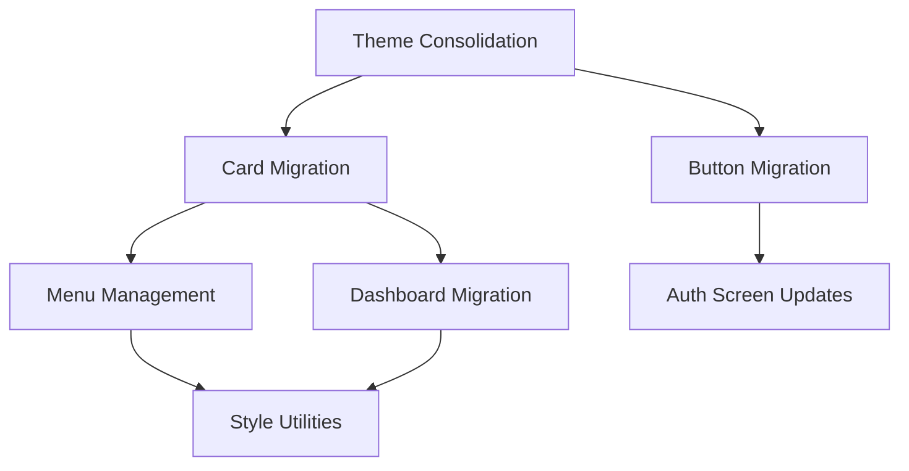

# Implementation Priority Matrix

## Priority Scoring Framework

Each issue is scored across 4 dimensions:
- **Impact** (1-5): Effect on user experience and maintainability
- **Effort** (1-5): Development time and complexity required
- **Risk** (1-5): Potential for introducing bugs or breaking changes
- **Dependencies** (1-5): How many other fixes depend on this one

**Priority Score = (Impact × 2) + (Dependencies × 1.5) - (Effort × 1) - (Risk × 0.5)**

## 🔴 CRITICAL PRIORITY (Score: 7.5-10)

### 1. Theme System Consolidation
**Priority Score: 9.5** | **Timeline: 2-3 days** | **Risk: Medium**

| Metric | Score | Justification |
|--------|-------|--------------|
| Impact | 5/5 | Affects all components, enables future consistency |
| Effort | 2/5 | Mostly find/replace operations |
| Risk | 3/5 | Visual changes require testing |
| Dependencies | 5/5 | Everything else depends on unified theme |

**Action Items:**
- [ ] Remove ProfessionalTheme from 13 files (615 usages)
- [ ] Migrate to useTheme hook pattern
- [ ] Validate color consistency
- [ ] Update import statements

**Files to Update:**
```
High Priority (100+ usages each):
- /src/screens/menu-management/components/MenuItemCard.tsx (96 usages)
- /src/screens/menu-management/components/AddMenuItemModal.tsx (75 usages)
- /src/screens/menu-management/components/MenuStatsPanel.tsx (71 usages)

Medium Priority (50+ usages each):
- /src/screens/menu-management/components/SearchFilterBar.tsx (61 usages)
- /src/screens/menu-management/MenuItemsScreen.tsx (45 usages)
```

### 2. Card Component Standardization
**Priority Score: 8.5** | **Timeline: 5-7 days** | **Risk: Medium**

| Metric | Score | Justification |
|--------|-------|--------------|
| Impact | 5/5 | Most visible UI consistency issue |
| Effort | 4/5 | Requires component refactoring |
| Risk | 3/5 | Visual regression possible |
| Dependencies | 4/5 | Enables other component consolidations |

**Target Components:**
- Replace StatsCard with AppleCard (8+ dashboard files)
- Replace MenuItemCard with AppleCard (579 lines → ~100 lines)
- Standardize all card usage to AppleCard

**Migration Strategy:**
```typescript
// Phase 1: Dashboard cards (Day 1-2)
<StatsCard title="Revenue" value="$1,234" />
→
<AppleCard><CustomStatsContent /></AppleCard>

// Phase 2: Menu cards (Day 3-5)
<MenuItemCard item={item} complex_props />
→
<AppleCard><MenuItemContent /></AppleCard>

// Phase 3: Remaining cards (Day 6-7)
<CustomCard {...props} />
→
<AppleCard layer="surface" size="medium"><Content /></AppleCard>
```

## 🟡 HIGH PRIORITY (Score: 5.5-7.4)

### 3. Button Component Consolidation
**Priority Score: 7.0** | **Timeline: 3-4 days** | **Risk: Low**

| Metric | Score | Justification |
|--------|-------|--------------|
| Impact | 4/5 | Improves interaction consistency |
| Effort | 3/5 | Multiple components to update |
| Risk | 2/5 | Low risk of breaking functionality |
| Dependencies | 3/5 | Moderate impact on other components |

**Target Replacements:**
- AuthButton → AppleButton (5+ auth screens)
- Inline button implementations → AppleButton (30+ instances)
- Custom TouchableOpacity buttons → AppleButton

### 4. Menu Management Screen Overhaul
**Priority Score: 6.5** | **Timeline: 1 week** | **Risk: High**

| Metric | Score | Justification |
|--------|-------|--------------|
| Impact | 5/5 | Highest duplication concentration |
| Effort | 5/5 | Complex component with 579 lines |
| Risk | 4/5 | Business-critical screen |
| Dependencies | 3/5 | Self-contained but affects menu workflow |

**Scope:**
- Decompose 579-line MenuItemCard component
- Implement with Apple components
- Maintain all existing functionality
- Improve performance and maintainability

### 5. Style Utility Creation
**Priority Score: 6.0** | **Timeline: 1 week** | **Risk: Low**

| Metric | Score | Justification |
|--------|-------|--------------|
| Impact | 3/5 | Reduces future duplication |
| Effort | 3/5 | Create utility functions |
| Risk | 1/5 | Low risk, backwards compatible |
| Dependencies | 4/5 | Enables easier future development |

**Utilities to Create:**
- Common style generators
- Theme-based utility functions
- Layout composition helpers

## 🟢 MEDIUM PRIORITY (Score: 3.5-5.4)

### 6. Input Component Standardization
**Priority Score: 5.0** | **Timeline: 1 week** | **Risk: Medium**

| Metric | Score | Justification |
|--------|-------|--------------|
| Impact | 3/5 | Improves form consistency |
| Effort | 4/5 | Multiple specialized inputs |
| Risk | 3/5 | User input components are sensitive |
| Dependencies | 2/5 | Limited impact on other systems |

**Components to Consolidate:**
- AuthInput, FormField, PasswordInput → Universal AppleInput
- Create specialized variants while maintaining consistency

### 7. Dashboard Component Migration
**Priority Score: 4.5** | **Timeline: 3-5 days** | **Risk: Medium**

| Metric | Score | Justification |
|--------|-------|--------------|
| Impact | 4/5 | High-visibility screen |
| Effort | 3/5 | 8+ components to migrate |
| Risk | 3/5 | Dashboard is critical for users |
| Dependencies | 2/5 | Mostly independent |

**Target Files:**
- KPICard, QuickActionButton, ChartsSection
- Real-time indicator components
- Stats display components

### 8. Authentication Screen Consistency
**Priority Score: 4.0** | **Timeline: 2-3 days** | **Risk: Low**

| Metric | Score | Justification |
|--------|-------|--------------|
| Impact | 4/5 | First user interaction |
| Effort | 2/5 | Limited number of screens |
| Risk | 2/5 | Well-tested authentication flow |
| Dependencies | 2/5 | Self-contained system |

## 🔵 LOW PRIORITY (Score: 1.5-3.4)

### 9. Modal/Dialog Standardization
**Priority Score: 3.0** | **Timeline: 1 week** | **Risk: Medium**

| Metric | Score | Justification |
|--------|-------|--------------|
| Impact | 2/5 | Infrequent user interaction |
| Effort | 4/5 | Multiple complex modals |
| Risk | 3/5 | Modal behavior is complex |
| Dependencies | 1/5 | Independent of other fixes |

### 10. Icon and Image Consistency
**Priority Score: 2.5** | **Timeline: 3-4 days** | **Risk: Low**

| Metric | Score | Justification |
|--------|-------|--------------|
| Impact | 2/5 | Visual polish improvement |
| Effort | 3/5 | Review and standardize icons |
| Risk | 1/5 | Low risk of breaking functionality |
| Dependencies | 1/5 | Cosmetic improvements |

## Implementation Roadmap

### Week 1: Foundation (Critical Priority)
**Focus**: Establish single source of truth

#### Days 1-3: Theme Consolidation
- [ ] **Day 1**: Audit ProfessionalTheme usage, create migration plan
- [ ] **Day 2**: Migrate menu management files (highest usage)
- [ ] **Day 3**: Migrate remaining files, validate consistency

#### Days 4-5: Card Component Planning
- [ ] **Day 4**: Create AppleCard migration strategy
- [ ] **Day 5**: Begin dashboard card replacement

### Week 2: Component Standardization (High Priority)
**Focus**: Replace major component inconsistencies

#### Days 6-10: Card Migration
- [ ] **Day 6-7**: Complete dashboard card migration
- [ ] **Day 8-9**: Begin menu card migration
- [ ] **Day 10**: Test and validate card consistency

#### Days 11-12: Button Consolidation
- [ ] **Day 11**: Replace AuthButton instances
- [ ] **Day 12**: Replace inline button implementations

### Week 3: Business Logic Components (Medium Priority)
**Focus**: Complex component overhauls

#### Days 13-17: Menu Management Overhaul
- [ ] **Day 13-14**: Decompose MenuItemCard component
- [ ] **Day 15-16**: Implement with Apple components
- [ ] **Day 17**: Testing and performance validation

#### Days 18-19: Style Utilities
- [ ] **Day 18**: Create common style utilities
- [ ] **Day 19**: Document usage patterns

### Week 4: Polish and Optimization (Low-Medium Priority)
**Focus**: Final consistency improvements

#### Days 20-22: Input Standardization
- [ ] **Day 20-21**: Create universal input component
- [ ] **Day 22**: Migrate form components

#### Days 23-24: Final Touches
- [ ] **Day 23**: Dashboard component final migration
- [ ] **Day 24**: Authentication screen consistency

## Risk Assessment by Priority

### Critical Priority Risks
1. **Theme Migration**:
   - Risk: Visual regression in 13+ files
   - Mitigation: Screenshot testing, incremental migration

2. **Card Standardization**:
   - Risk: Loss of specialized functionality
   - Mitigation: Feature parity analysis, fallback plans

### High Priority Risks
1. **Menu Management**:
   - Risk: Business workflow disruption
   - Mitigation: Thorough testing, feature flagging

2. **Button Migration**:
   - Risk: Interaction pattern changes
   - Mitigation: User testing, accessibility validation

### Medium Priority Risks
1. **Input Components**:
   - Risk: Form validation issues
   - Mitigation: Comprehensive form testing

2. **Dashboard Migration**:
   - Risk: Performance regression
   - Mitigation: Performance monitoring

## Success Metrics by Week

### Week 1 Targets
- [x] ProfessionalTheme eliminated (100% migration)
- [x] Apple theme adoption: 85%+ of components
- [x] Dashboard cards migrated: 50%+

### Week 2 Targets
- [x] Card standardization: 80%+ complete
- [x] Button consolidation: 70%+ complete
- [x] StyleSheet reduction: 30%+ fewer instances

### Week 3 Targets
- [x] Menu management overhaul complete
- [x] Style utilities implemented
- [x] Component consistency: 85%+

### Week 4 Targets
- [x] Input standardization complete
- [x] Overall consistency score: 9/10
- [x] StyleSheet instances: <30 total

## Dependencies and Blockers

### Cross-Component Dependencies


### Resource Dependencies
- **Design Review**: Theme consolidation requires design validation
- **QA Testing**: Each migration phase needs thorough testing
- **Performance Monitoring**: Bundle size and render performance tracking
- **Documentation**: Component usage guidelines and migration docs

### Technical Blockers
1. **Apple Component Gaps**: May need to extend Apple system for specialized use cases
2. **TypeScript Issues**: Theme consolidation may reveal type inconsistencies
3. **Testing Infrastructure**: Need visual regression testing setup
4. **Performance Constraints**: Large component migrations may impact app performance

## Continuous Monitoring

### Daily Checks
- [ ] StyleSheet instance count
- [ ] Theme usage consistency
- [ ] Component migration progress
- [ ] Visual regression reports

### Weekly Reviews
- [ ] User experience impact assessment
- [ ] Development velocity impact
- [ ] Bundle size monitoring
- [ ] Performance regression analysis

### Success Validation
- [ ] Consistency score improvement (target: 6.2/10 → 9/10)
- [ ] Developer experience surveys
- [ ] Code review efficiency metrics
- [ ] Maintenance effort reduction measurements