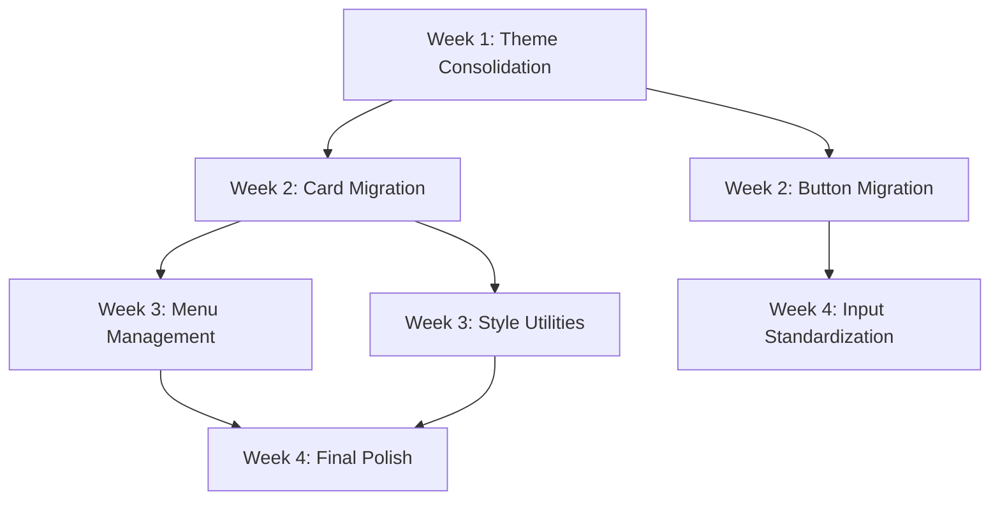

# Weekly Milestones Tracking

## 📊 Overall Progress Dashboard

| Week | Focus Area | Target | Current Status | Completion |
|------|------------|--------|----------------|------------|
| 1 | Foundation | Theme consolidation | 🔄 In Progress | 5% |
| 2 | Components | Card/Button standardization | ⏳ Pending | 0% |
| 3 | Business Logic | Complex component overhauls | ⏳ Pending | 0% |
| 4 | Polish | Final touches & monitoring | ⏳ Pending | 0% |

**Overall Project Completion**: 1.25% (5% of Week 1)

---

## Week 1: Foundation (Sep 28 - Oct 4, 2025)
**Focus**: Establish single source of truth for themes and components

### 🎯 Week 1 Goals
| Goal | Target | Current | Status |
|------|--------|---------|--------|
| ProfessionalTheme Elimination | 13 files → 0 files | 13 files | ⏳ Pending |
| Theme Consistency | 85% useTheme adoption | ~72% | 🔄 In Progress |
| Dashboard Card Migration | 50% AppleCard adoption | 0% | ⏳ Pending |
| Automation Scripts | 2 scripts created | 0 scripts | ⏳ Pending |

### ✅ Week 1 Achievements
- ✅ **Day 1 (Sep 28)**: Project structure and tracking system setup

### 🔄 Week 1 In Progress
- 🔄 **Day 1**: ProfessionalTheme usage audit

### ⏳ Week 1 Pending
- ⏳ Automated theme migration script creation
- ⏳ Menu management file migrations (highest priority)
- ⏳ Remaining ProfessionalTheme file migrations
- ⏳ Visual consistency validation
- ⏳ AppleStatsCard wrapper creation
- ⏳ Dashboard card migration initiation

### 📊 Week 1 Success Metrics
- [ ] **Primary**: ProfessionalTheme eliminated (100% migration)
- [ ] **Secondary**: Apple theme adoption reaches 85%+ of components
- [ ] **Tertiary**: Dashboard cards migrated to AppleCard (50%+ complete)

---

## Week 2: Component Standardization (Oct 5 - Oct 11, 2025)
**Focus**: Replace major component inconsistencies

### 🎯 Week 2 Goals
| Goal | Target | Current | Status |
|------|--------|---------|--------|
| Card Standardization | 80% AppleCard adoption | 0% | ⏳ Pending |
| Button Consolidation | 70% AppleButton adoption | ~30% | ⏳ Pending |
| Menu Planning | Decomposition strategy complete | 0% | ⏳ Pending |
| StyleSheet Reduction | 30% fewer instances | 0% | ⏳ Pending |

### 📊 Week 2 Success Metrics
- [ ] Card standardization: 80%+ complete
- [ ] Button consolidation: 70%+ complete
- [ ] StyleSheet reduction: 30%+ fewer instances
- [ ] Menu management decomposition plan finalized

---

## Week 3: Business Logic Components (Oct 12 - Oct 18, 2025)
**Focus**: Complex component overhauls and performance

### 🎯 Week 3 Goals
| Goal | Target | Current | Status |
|------|--------|---------|--------|
| Menu Management Overhaul | 579-line component decomposed | 0% | ⏳ Pending |
| Style Utilities | Utility system implemented | 0% | ⏳ Pending |
| Performance Validation | No regression | N/A | ⏳ Pending |
| Component Consistency | 85% Apple adoption | ~30% | ⏳ Pending |

### 📊 Week 3 Success Metrics
- [ ] Menu management overhaul complete
- [ ] Style utilities implemented and adopted
- [ ] Component consistency reaches 85%+
- [ ] Performance maintained or improved

---

## Week 4: Polish & Monitoring (Oct 19 - Oct 25, 2025)
**Focus**: Final consistency improvements and automation

### 🎯 Week 4 Goals
| Goal | Target | Current | Status |
|------|--------|---------|--------|
| Input Standardization | Universal AppleInput | 0% | ⏳ Pending |
| Final Migrations | 95% Apple adoption | ~30% | ⏳ Pending |
| Monitoring Setup | Automated tracking | 0% | ⏳ Pending |
| Overall Consistency | 9/10 score | 6.2/10 | ⏳ Pending |

### 📊 Week 4 Success Metrics
- [ ] Input standardization complete
- [ ] Overall consistency score reaches 9/10
- [ ] StyleSheet instances reduced to <30 total
- [ ] Automated monitoring and enforcement active

---

## 🎯 Critical Path Dependencies

## 📈 Risk Tracking

### Week 1 Risks
- **Medium Risk**: Visual regression during theme migration
- **Low Risk**: Performance impact from theme consolidation

### Mitigation Strategies
- Incremental migration with visual validation
- Screenshot testing for critical components
- Performance monitoring throughout implementation

---

**Last Updated**: September 28, 2025, 09:30 AM
**Current Phase**: Week 1 - Foundation (Day 1)
**Next Milestone**: Complete ProfessionalTheme audit by end of Day 1