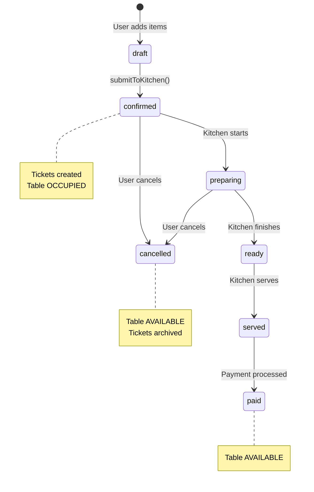

# Clean Architecture Plan - Single Source of Truth

## Status: IMPLEMENTATION PLAN

---

## Business Logic Flow (MUST FOLLOW)

```
┌─────────────────────────────────────────────────────────────────────────┐
│                        ORDER LIFECYCLE                                   │
├─────────────────────────────────────────────────────────────────────────┤
│                                                                          │
│  1. CREATE ORDER (POS Screen)                                           │
│     └─ Select Table → Add Items → Submit to Kitchen                     │
│        └─ Validate: Table must be AVAILABLE                             │
│        └─ Validate: Table must NOT have active order                    │
│                                                                          │
│  2. ORDER CONFIRMED (Kitchen Gets Tickets)                              │
│     └─ Order status: draft → confirmed                                  │
│     └─ Table status: AVAILABLE → OCCUPIED                               │
│     └─ Kitchen tickets created (one per station)                        │
│                                                                          │
│  3. KITCHEN ONLY UPDATES (Status Changes)                               │
│     └─ Ticket: pending → preparing → ready → served                     │
│     └─ Order status derived from ALL tickets                            │
│     └─ NO OTHER SYSTEM CAN CHANGE ORDER STATUS                          │
│                                                                          │
│  4. PAYMENT AVAILABLE (Only when ALL items served)                      │
│     └─ Order status must be: served                                     │
│     └─ Payment button appears ONLY at this point                        │
│                                                                          │
│  5. PAYMENT COMPLETE                                                     │
│     └─ Order status: served → paid                                      │
│     └─ Table status: OCCUPIED → AVAILABLE                               │
│     └─ Kitchen tickets cleaned up                                       │
│                                                                          │
└─────────────────────────────────────────────────────────────────────────┘
```

---

## Single Source of Truth Architecture

### Data Storage (AsyncStorage ONLY)

```
AsyncStorage
├── @unified_orders        ← UnifiedOrderStorageService
├── @kitchen_tickets       ← KitchenStorageService
├── @table_data           ← TableStorageService
├── @payment_records      ← PaymentStorageService
├── @menu_categories      ← MenuStorageService
├── @menu_items           ← MenuStorageService
└── @auth_session         ← AuthStorageService
```

### NO MORE:
- ❌ FixedMockTableApiClient
- ❌ MockMenuApiClient
- ❌ MOCK_TABLES direct import
- ❌ legacyOrderEventEmitter (use unified only)

---

## Unified Event System

### Single Event Emitter

```typescript
// src/services/events/UnifiedEventEmitter.ts
export const unifiedEventEmitter = {
  // ORDER EVENTS
  ORDER_CREATED: 'ORDER_CREATED',
  ORDER_STATUS_CHANGED: 'ORDER_STATUS_CHANGED',
  ORDER_PAID: 'ORDER_PAID',
  ORDER_CANCELLED: 'ORDER_CANCELLED',

  // SYSTEM EVENTS
  SYSTEM_RESET: 'SYSTEM_RESET',
};

// ALL contexts use this single emitter
```

### Event Flow

```
ORDER_CREATED
├─→ TableProvider: Mark table OCCUPIED
├─→ KitchenTicketRouter: Create tickets by station
└─→ KitchenContext: Load new tickets

ORDER_STATUS_CHANGED (Kitchen only)
└─→ UnifiedOrderContext: Update order status

ORDER_PAID
├─→ TableProvider: Mark table AVAILABLE
└─→ KitchenContext: Archive/cleanup tickets

ORDER_CANCELLED
├─→ TableProvider: Mark table AVAILABLE
└─→ KitchenContext: Cancel related tickets

SYSTEM_RESET
├─→ All contexts: Reset state
└─→ All storage: Clear data
```

---

## Folder Structure (Clean)

```
src/
├── context/
│   ├── unified-order/
│   │   ├── UnifiedOrderContext.tsx    ← Single order context
│   │   ├── unifiedOrderReducer.ts
│   │   └── index.ts
│   ├── kitchen/
│   │   ├── EnhancedKitchenContext.tsx ← Ticket management
│   │   ├── kitchenReducer.ts
│   │   └── index.ts
│   ├── table/
│   │   ├── TableProvider.tsx          ← Table state
│   │   ├── TableContext.tsx
│   │   └── index.ts
│   └── auth/
│       └── AuthProvider.tsx
│
├── services/
│   ├── storage/                       ← AsyncStorage ONLY
│   │   ├── UnifiedOrderStorageService.ts
│   │   ├── KitchenStorageService.ts
│   │   ├── TableStorageService.ts
│   │   ├── MenuStorageService.ts
│   │   ├── PaymentStorageService.ts
│   │   └── index.ts
│   │
│   ├── events/
│   │   └── UnifiedEventEmitter.ts     ← Single event system
│   │
│   ├── kitchen/
│   │   ├── KitchenTicketRouter.ts     ← Routes orders to tickets
│   │   └── index.ts
│   │
│   └── api/                           ← REMOVE all mock clients
│       └── (empty or real API only)
│
├── data/
│   └── seed/
│       └── initialTableData.ts        ← Seed data for first run
│
└── types/
    ├── unified-order.types.ts
    ├── kitchen.types.ts
    ├── table.types.ts
    └── index.ts
```

---

## Provider Hierarchy

```typescript
<AuthProvider>
  <TableProvider>                    {/* Subscribes to ORDER events */}
    <UnifiedOrderProvider>           {/* Emits ORDER events */}
      <EnhancedKitchenProvider>      {/* Creates tickets, updates status */}
        <BillSplitProvider>
          <PaymentProvider>
            {children}
          </PaymentProvider>
        </BillSplitProvider>
      </EnhancedKitchenProvider>
    </UnifiedOrderProvider>
  </TableProvider>
</AuthProvider>
```

**Key Change:** `EnhancedKitchenProvider` is INSIDE `UnifiedOrderProvider` to ensure:
- Kitchen can listen for ORDER_CREATED events
- Kitchen can update order status via ORDER_STATUS_CHANGED

---

## Implementation Tasks

### Task 1: Unify Event System
- [ ] Create single `UnifiedEventEmitter.ts`
- [ ] Remove `legacyOrderEventEmitter`
- [ ] Update all contexts to use unified emitter

### Task 2: Seed Tables to AsyncStorage
- [ ] Create `initialTableData.ts` with proper table structure
- [ ] Update `TableStorageService.initialize()` to seed if empty
- [ ] Remove `FixedMockTableApiClient`
- [ ] Update `TableServiceClass` to use storage only

### Task 3: Fix Kitchen Ticket Flow
- [ ] Add ORDER_CREATED listener in `EnhancedKitchenContext`
- [ ] Call `KitchenTicketRouter.routeOrder()` when order created
- [ ] Ensure tickets are saved to `KitchenStorageService`

### Task 4: Add Order Validation
- [ ] In `submitToKitchen()`, check for existing active order on table
- [ ] Return error if table occupied

### Task 5: Add Table Status Events
- [ ] ORDER_CREATED → Mark table OCCUPIED
- [ ] ORDER_PAID → Mark table AVAILABLE
- [ ] ORDER_CANCELLED → Mark table AVAILABLE

### Task 6: Kitchen-Only Status Updates
- [ ] Ensure only kitchen can change order status
- [ ] Payment only available when status === 'served'

### Task 7: Remove Mock Data Sources
- [ ] Delete or empty `FixedMockTableApiClient.ts`
- [ ] Delete or empty `MockMenuApiClient.ts`
- [ ] Remove direct `MOCK_TABLES` imports

---

## Status Flow Diagram



---

## Validation Rules

### Order Creation
```typescript
// MUST check before creating order
if (!selectedTable) {
  return { error: 'No table selected' };
}

if (cart.length === 0) {
  return { error: 'Cart is empty' };
}

const existingOrder = activeOrders.find(o => o.tableId === selectedTable.id);
if (existingOrder) {
  return { error: `Table has active order: ${existingOrder.orderNumber}` };
}

const tableStatus = await tableStorageService.getTable(selectedTable.id);
if (tableStatus?.status !== 'available') {
  return { error: 'Table is not available' };
}
```

### Payment
```typescript
// MUST check before allowing payment
if (order.status !== 'served') {
  return { error: 'Order must be served before payment' };
}
```

### Status Transitions
```typescript
// Valid transitions (Kitchen ONLY except payment)
const validTransitions = {
  draft: ['confirmed'],           // User submits
  confirmed: ['preparing', 'cancelled'],  // Kitchen starts or cancel
  preparing: ['ready', 'cancelled'],      // Kitchen finishes or cancel
  ready: ['served', 'cancelled'],         // Kitchen serves or cancel
  served: ['paid'],               // Payment only
  paid: [],                       // Terminal state
  cancelled: [],                  // Terminal state
};
```

---

## Testing Checklist

After implementation:

- [ ] Create order → Table shows OCCUPIED
- [ ] Create order → Kitchen display shows tickets
- [ ] Kitchen updates ticket → Order status changes
- [ ] All tickets served → Payment button appears
- [ ] Payment complete → Table shows AVAILABLE
- [ ] Cancel order → Table shows AVAILABLE
- [ ] Cannot create 2nd order on occupied table
- [ ] App restart → Data persists from AsyncStorage
- [ ] Clear data → All storage and state reset
