# Current Architecture Analysis - Order Management System

## Status: BROKEN - Critical Integration Gaps Identified

---

## Executive Summary

The system has **three separate but interdependent systems** that operate in **data silos** with broken synchronization:

| System | Context | Storage | Status |
|--------|---------|---------|--------|
| Order Management | UnifiedOrderContext | UnifiedOrderStorageService | Partially Working |
| Table Management | TableProvider | TableStorageService + MockAPI | BROKEN |
| Kitchen Operations | EnhancedKitchenContext | KitchenStorageService | DISCONNECTED |

**Critical Failures:**
- Users CAN place multiple orders on the same table
- Tables DON'T mark as OCCUPIED when orders are placed
- Kitchen tickets are NEVER created from orders
- Table status changes are NOT persisted

---

## System Architecture Overview

### Current Provider Hierarchy

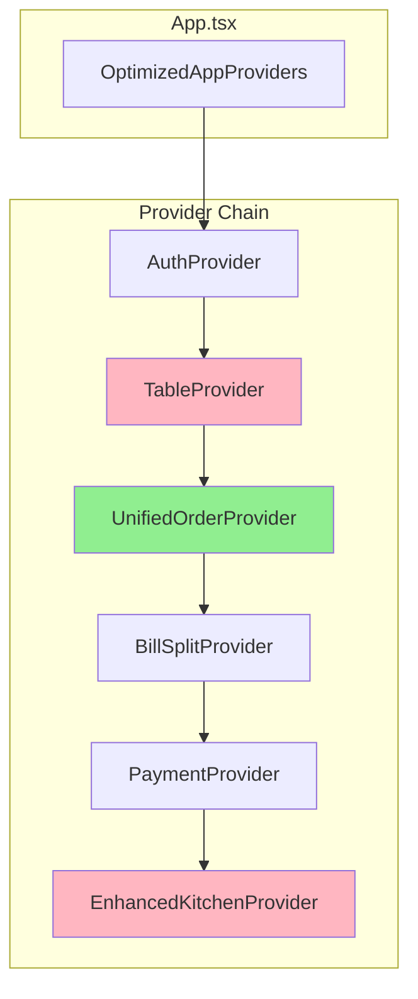

### Data Storage Architecture (FRAGMENTED)

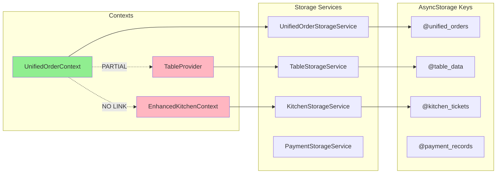

---

## Component Deep Dive

### 1. UnifiedOrderContext (Primary Order System)

**Location:** `src/context/unified-order/UnifiedOrderContext.tsx`

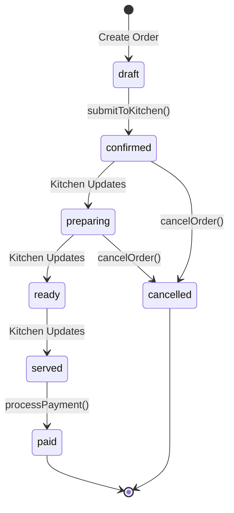

**State Structure:**
```typescript
interface UnifiedOrderState {
  currentOrder: UnifiedOrder | null;
  selectedTable: Table | null;
  cart: CartItem[];
  orders: UnifiedOrder[];
  activeOrders: UnifiedOrder[];      // Status NOT in ['paid', 'cancelled']
  filteredOrders: UnifiedOrder[];
  isSubmitting: boolean;
  isLoading: boolean;
  error: string | null;
}
```

**Key Actions:**
| Action | What It Does | What's MISSING |
|--------|--------------|----------------|
| `submitToKitchen()` | Creates order, saves to storage | NO validation for existing orders on table |
| `updateOrderStatus()` | Updates order status | Works correctly |
| `processPayment()` | Marks paid, emits ORDER_PAID | Works correctly |
| `cancelOrder()` | Marks cancelled, emits ORDER_CANCELLED | Works correctly |
| `getActiveOrderForTable()` | Returns active order for table | EXISTS but NEVER CALLED |

### 2. TableProvider (Table Management)

**Location:** `src/context/table/TableProvider.tsx`

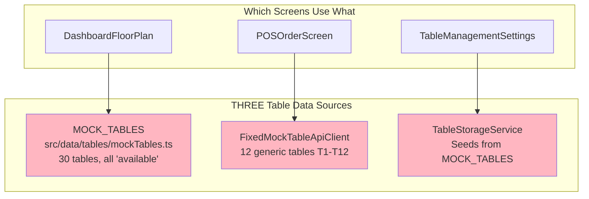

**Event Subscriptions:**
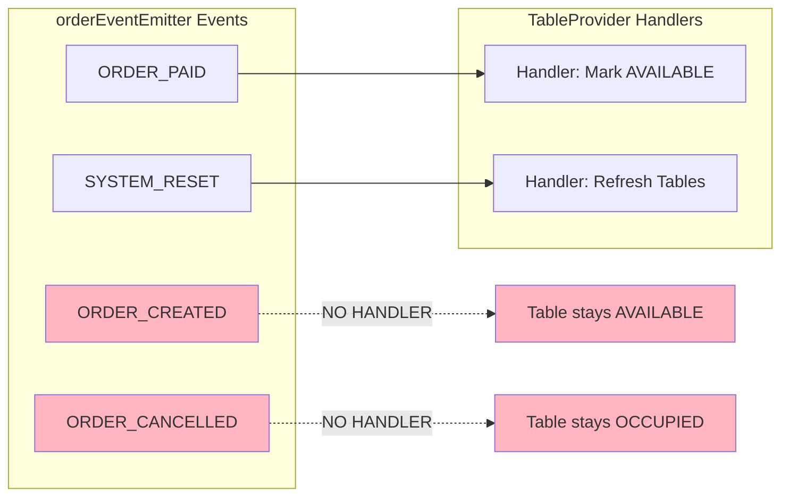

### 3. EnhancedKitchenContext (Kitchen Operations)

**Location:** `src/context/kitchen/EnhancedKitchenContext.tsx`

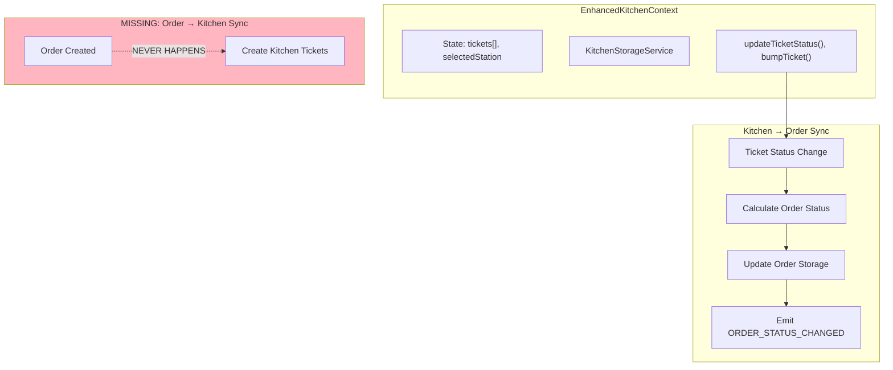

---

## Event System Architecture

### Event Flow Diagram

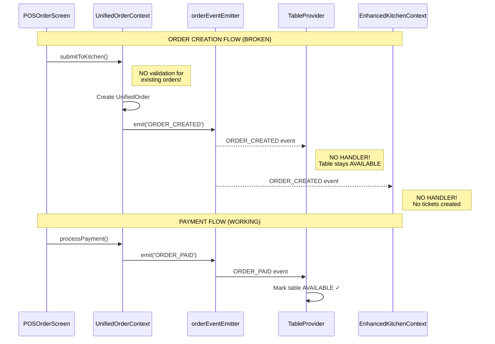

### Event Types and Handlers

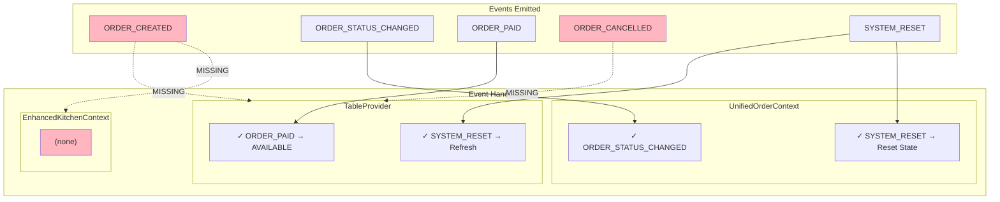

---

## Data Flow Analysis

### Order Creation Flow (CURRENT - BROKEN)

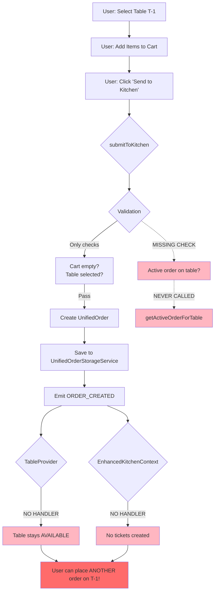

### Table Status Lifecycle (EXPECTED vs ACTUAL)

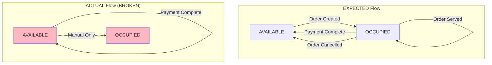

### Kitchen Ticket Flow (EXPECTED vs ACTUAL)

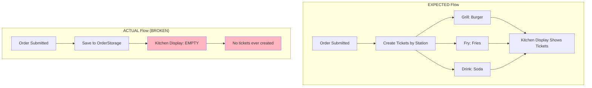

---

## Multiple Orders Per Table (BUG DEMONSTRATION)

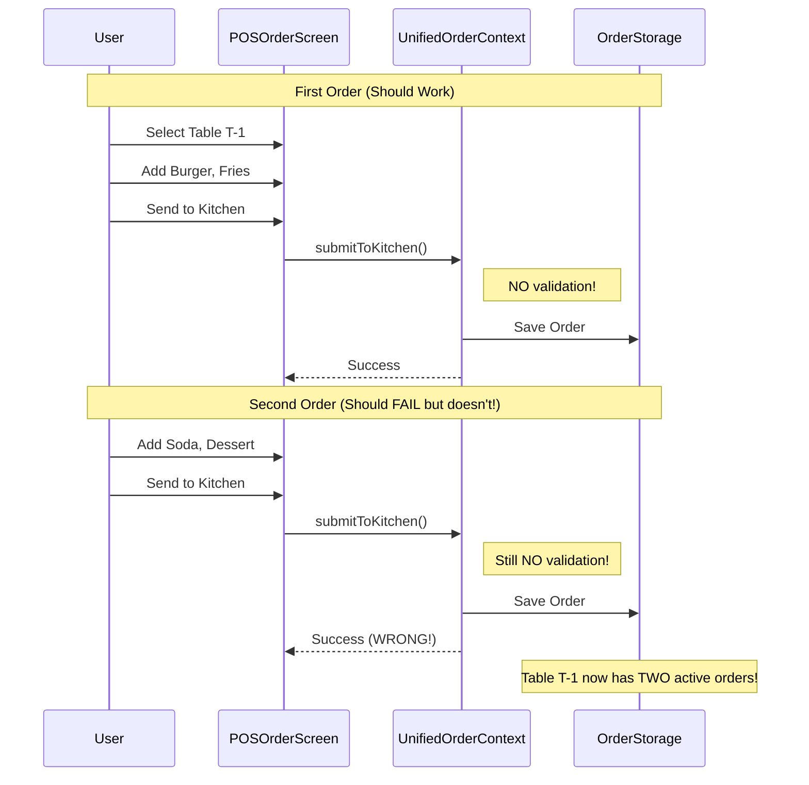

---

## Storage Service Architecture

### Current Storage Silos

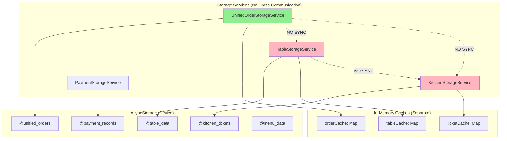

### Table Data Source Confusion

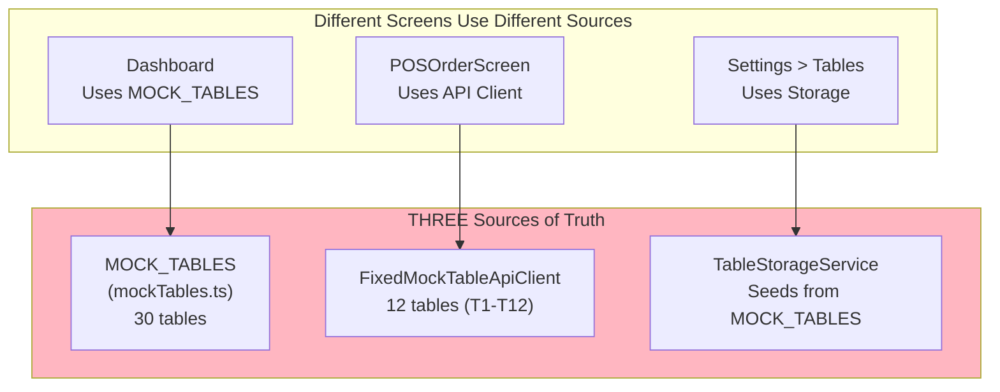

---

## Provider Initialization Order

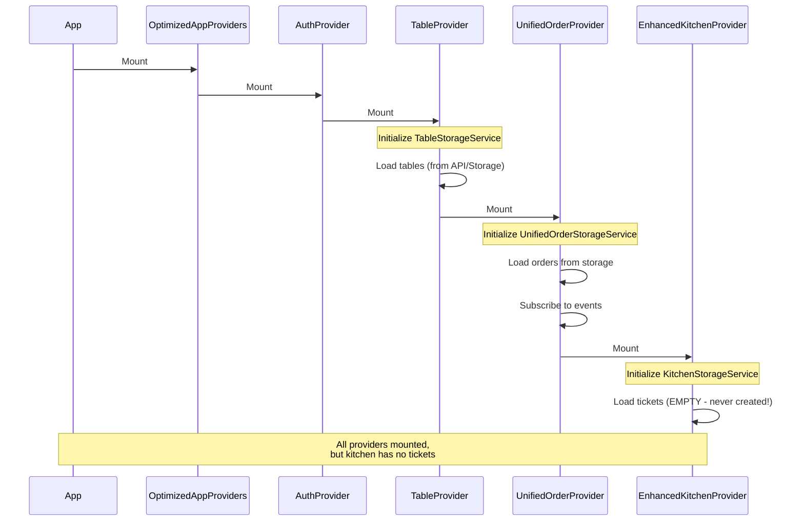

---

## Summary of Architectural Gaps

| Gap | Current State | Required State | Impact |
|-----|---------------|----------------|--------|
| **Order Validation** | None | Check for active orders | Multiple orders per table |
| **Table Status on Order** | No handler | ORDER_CREATED → OCCUPIED | Tables always "available" |
| **Table Status on Cancel** | No handler | ORDER_CANCELLED → AVAILABLE | Tables stuck "occupied" |
| **Kitchen Ticket Creation** | Never happens | Create on ORDER_CREATED | Empty kitchen display |
| **Table Data Source** | 3 sources | 1 unified source | Inconsistent table data |
| **Table Status Persistence** | Not persisted | Save to storage | Status lost on reload |

---

## Files Involved

### Core Files
| File | Purpose | Status |
|------|---------|--------|
| `src/context/unified-order/UnifiedOrderContext.tsx` | Order management | Works, missing validation |
| `src/context/table/TableProvider.tsx` | Table management | Missing event handlers |
| `src/context/kitchen/EnhancedKitchenContext.tsx` | Kitchen operations | Disconnected from orders |

### Storage Files
| File | Purpose | Status |
|------|---------|--------|
| `src/services/storage/UnifiedOrderStorageService.ts` | Order persistence | Working |
| `src/services/storage/TableStorageService.ts` | Table persistence | Not fully used |
| `src/services/storage/KitchenStorageService.ts` | Kitchen persistence | Empty (no tickets) |

### Data Files
| File | Purpose | Status |
|------|---------|--------|
| `src/data/tables/mockTables.ts` | Mock table data | Conflicting source |
| `src/services/api/table/FixedMockTableApiClient.ts` | Mock API | Conflicting source |
