# Data Flow Analysis - Order Management System

## Overview

This document traces the complete data flow through the system, identifying where flows are broken and what should happen vs what actually happens.

---

## Flow 1: Order Creation (BROKEN)

### Expected Flow

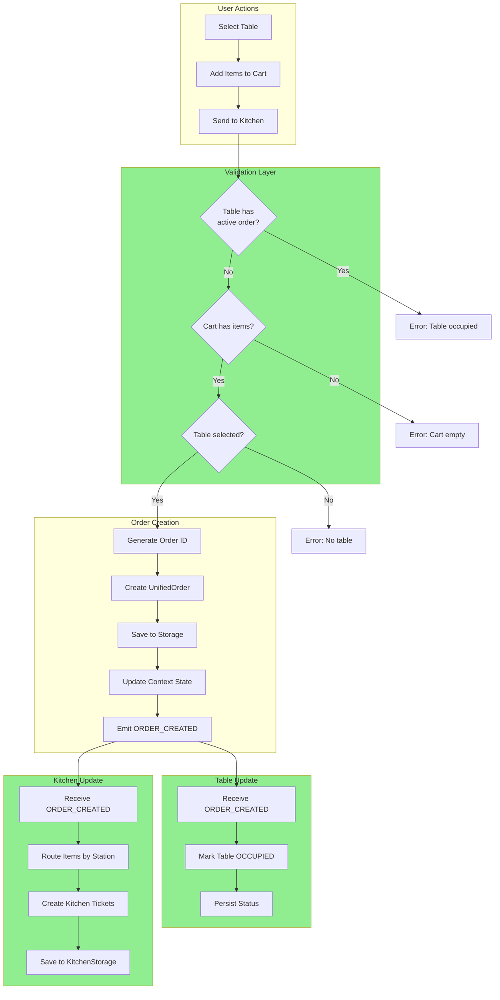

### Actual Flow (BROKEN)

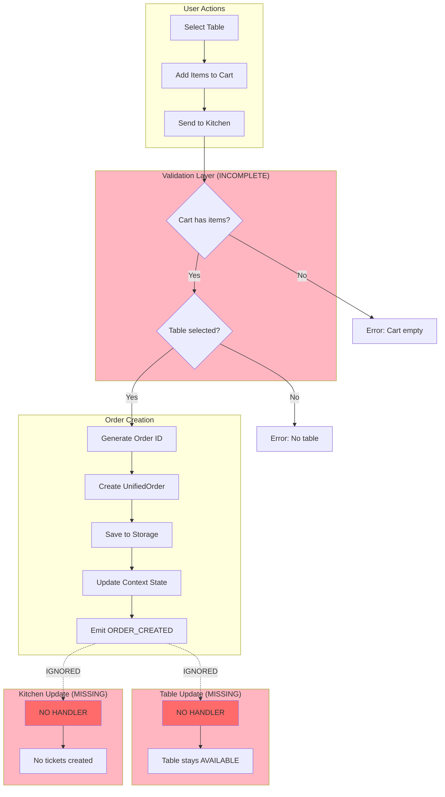

### Code Trace

**File:** `src/context/unified-order/UnifiedOrderContext.tsx`

```typescript
// Line 371-442: submitToKitchen()
const submitToKitchen = useCallback(async (): Promise<...> => {
  const currentState = stateRef.current;

  // VALIDATION (INCOMPLETE)
  if (!currentState.selectedTable || currentState.cart.length === 0) {
    return { success: false, error: 'No items in cart or table not selected' };
  }

  // ❌ MISSING: Check for existing active order on this table
  // const existingOrder = currentState.activeOrders.find(
  //   o => o.tableId === currentState.selectedTable!.id
  // );
  // if (existingOrder) {
  //   return { success: false, error: 'Table already has active order' };
  // }

  // Create order (no validation)
  const orderId = `order_${Date.now()}_${Math.random().toString(36).substr(2, 9)}`;
  const orderNumber = generateOrderNumber();

  const order: UnifiedOrder = {
    id: orderId,
    orderNumber,
    tableId: currentState.selectedTable.id,  // ← No validation!
    // ... rest of order
  };

  await unifiedOrderStorageService.saveOrder(order);
  dispatch({ type: 'ADD_ORDER', payload: order });

  // Emit event - but no one handles it properly
  orderEventEmitter.emit('ORDER_CREATED', orderId, {
    orderNumber,
    tableId: order.tableId,
  });

  return { success: true, orderId, orderNumber };
}, []);
```

**File:** `src/context/table/TableProvider.tsx`

```typescript
// Line 120-149: Event subscriptions
useEffect(() => {
  // ✓ ORDER_PAID handler exists
  const unsubscribePaid = orderEventEmitter.on('ORDER_PAID', (event) => {
    // Handle table release
  });

  // ✓ SYSTEM_RESET handler exists
  const unsubscribeReset = orderEventEmitter.on('SYSTEM_RESET', () => {
    // Refresh tables
  });

  // ❌ ORDER_CREATED handler MISSING
  // ❌ ORDER_CANCELLED handler MISSING

  return () => {
    unsubscribePaid();
    unsubscribeReset();
  };
}, [updateTableStatus, refreshTables]);
```

---

## Flow 2: Table Status Management (BROKEN)

### Table Status State Machine

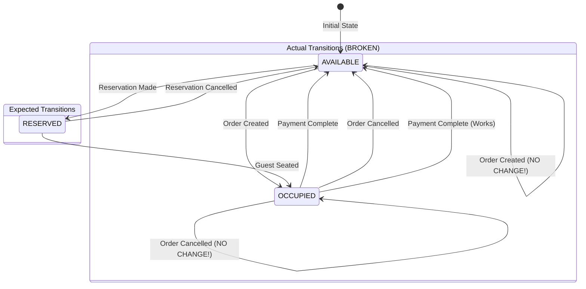

### Table Update Flow

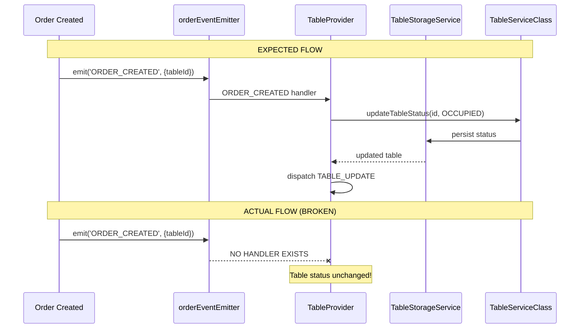

### Multiple Data Sources Problem

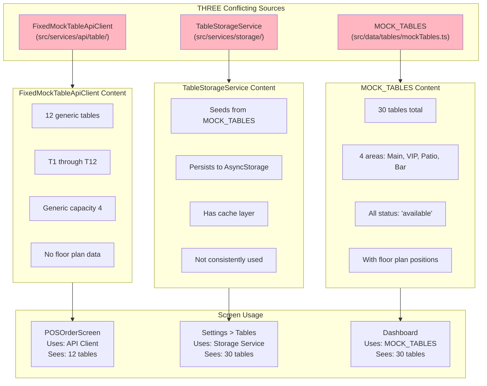

---

## Flow 3: Kitchen Ticket Creation (MISSING)

### Expected Kitchen Flow

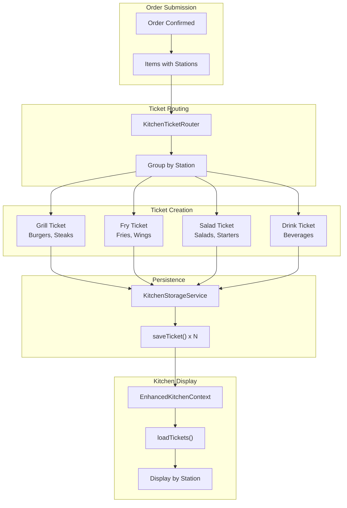

### Actual Kitchen Flow (BROKEN)

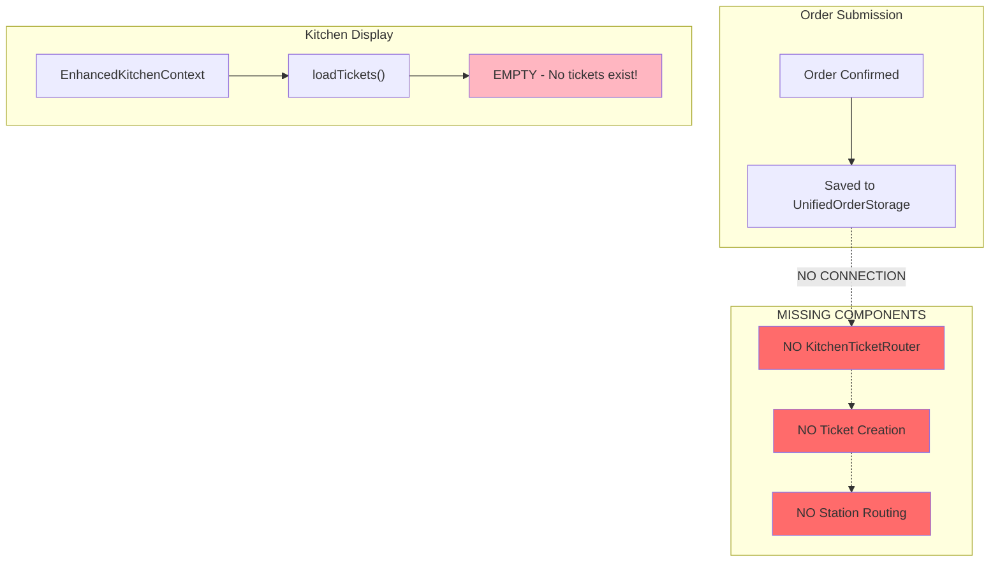

### Kitchen Data Model

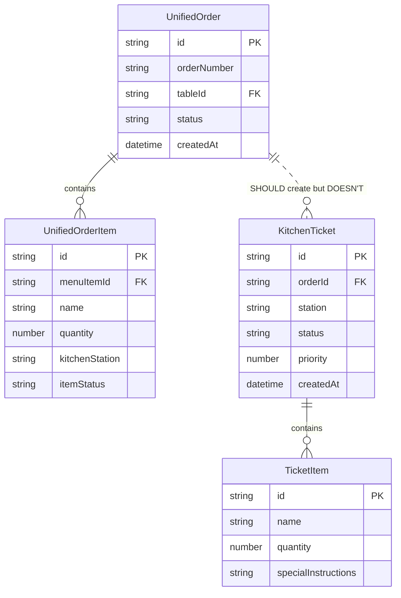

---

## Flow 4: Payment Processing (WORKING)

### Payment Flow

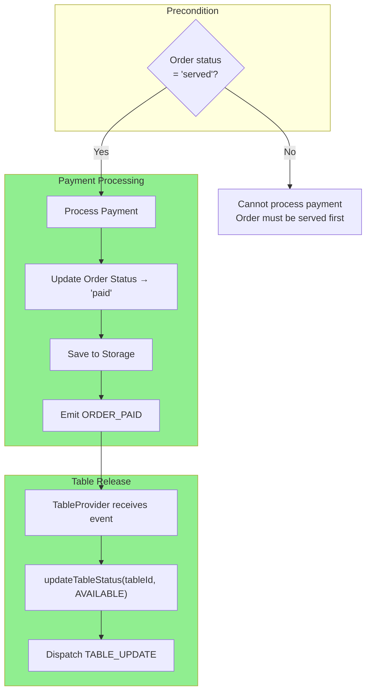

### Payment Code Trace

**File:** `src/context/unified-order/UnifiedOrderContext.tsx`

```typescript
// Line 528-570: processPayment()
const processPayment = useCallback(
  async (orderId: string, paymentMethod: string): Promise<...> => {
    const order = state.orders.find((o) => o.id === orderId);

    if (!order) {
      return { success: false, error: 'Order not found' };
    }

    // ✓ CORRECT: Validate order is served
    if (order.status !== 'served') {
      return { success: false, error: 'Order must be served before payment' };
    }

    // Update to paid
    const updatedOrder = {
      ...order,
      status: 'paid' as UnifiedOrderStatus,
      paymentMethod,
      paidAt: new Date().toISOString(),
    };

    await unifiedOrderStorageService.updateOrder(orderId, updatedOrder);
    dispatch({ type: 'UPDATE_ORDER_STATUS', payload: { orderId, status: 'paid' } });

    // ✓ CORRECT: Emit event with tableId
    orderEventEmitter.emit('ORDER_PAID', orderId, {
      tableId: order.tableId,
      method: paymentMethod,
      amount: order.totalAmount,
    });

    return { success: true };
  },
  [state.orders]
);
```

**File:** `src/context/table/TableProvider.tsx`

```typescript
// Line 125-135: ORDER_PAID handler (WORKING)
const unsubscribePaid = orderEventEmitter.on('ORDER_PAID', (event) => {
  const tableId = event.data?.tableId as string;
  if (tableId) {
    updateTableStatus(tableId, { status: TableStatus.AVAILABLE })
      .then(() => {
        if (__DEV__) {
          console.log(`[TableProvider] ✅ Table ${tableId} set to AVAILABLE after payment`);
        }
      })
      .catch((error) => {
        console.error(`[TableProvider] ❌ Failed to release table ${tableId}:`, error);
      });
  }
});
```

---

## Flow 5: Kitchen → Order Status Sync (WORKING)

### Kitchen Status Update Flow

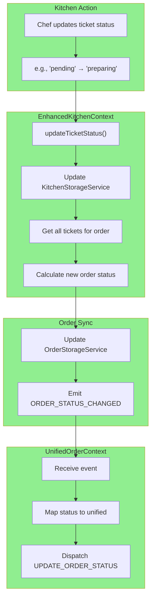

### Status Aggregation Logic

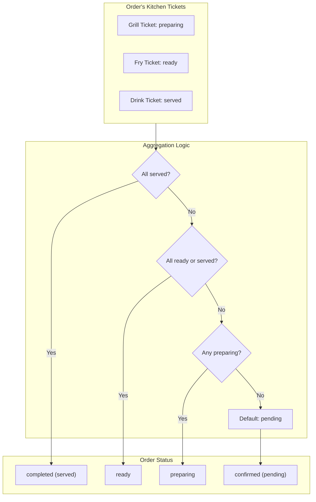

---

## Flow 6: Clear All Data (WORKING)

### Clear Data Flow

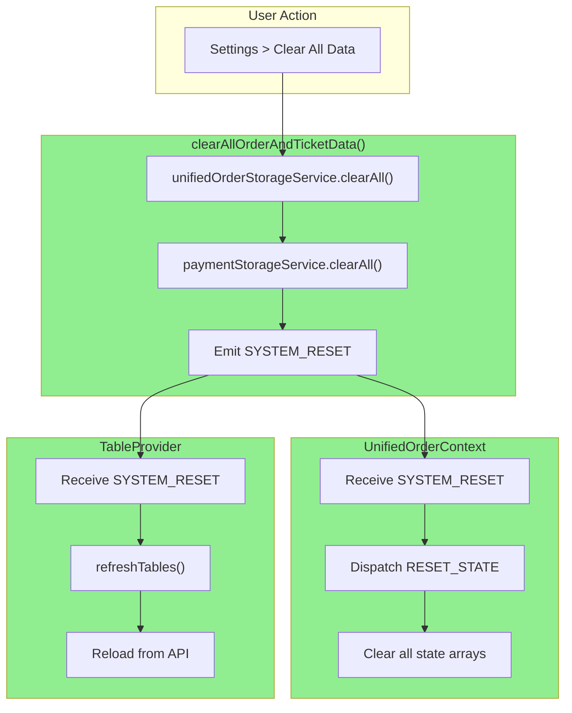

---

## Summary: Flow Status

| Flow | Status | Issue |
|------|--------|-------|
| Order Creation | **BROKEN** | No validation, no table update, no kitchen tickets |
| Table Status Update | **BROKEN** | No ORDER_CREATED handler, no ORDER_CANCELLED handler |
| Kitchen Ticket Creation | **MISSING** | No integration exists |
| Payment Processing | **WORKING** | Correctly releases table |
| Kitchen → Order Sync | **WORKING** | Status propagates correctly |
| Clear All Data | **WORKING** | Resets all state |

### Critical Path Failures

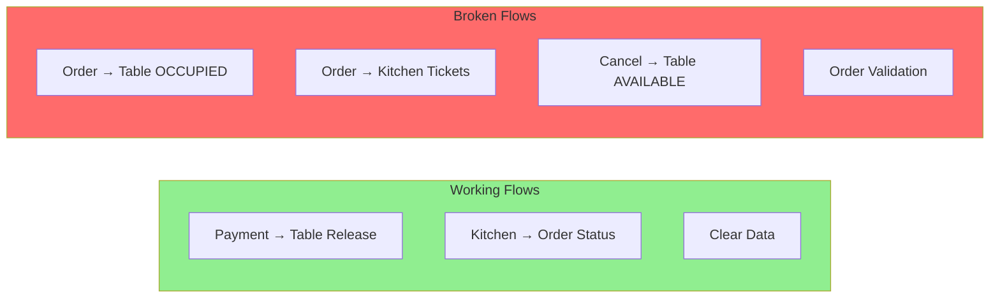
