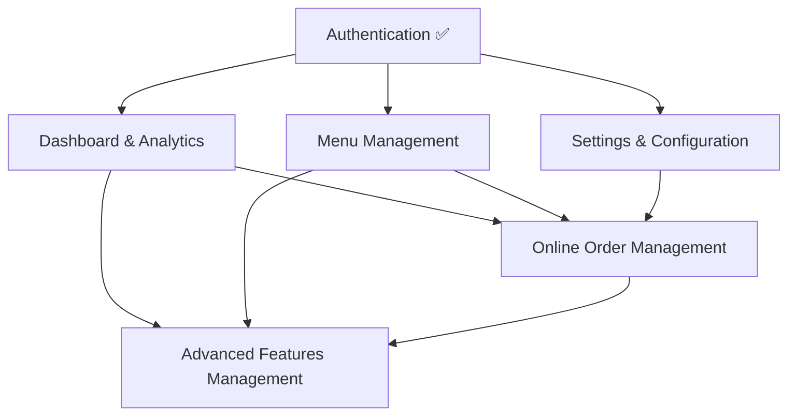

# Feature Prioritization Matrix - Wireframe Implementation

## Prioritization Methodology

This matrix evaluates features based on multiple criteria to determine optimal implementation order, considering business value, technical complexity, dependencies, and resource requirements.

## Evaluation Criteria

### Primary Criteria (Weight: 40%)
- **Business Impact**: Revenue generation, operational efficiency
- **User Experience**: Staff productivity, customer satisfaction
- **Dependencies**: Technical and functional prerequisites

### Secondary Criteria (Weight: 35%)
- **Implementation Complexity**: Development effort, risk level
- **Resource Requirements**: Team capacity, timeline impact
- **Integration Scope**: Service dependencies, context requirements

### Supporting Criteria (Weight: 25%)
- **Testing Complexity**: Quality assurance effort
- **Maintenance Burden**: Long-term support requirements
- **Innovation Value**: Competitive advantage, market differentiation

## Feature Analysis Matrix

| Feature | Business Impact | Dependencies | Complexity | Priority Score | Implementation Order |
|---------|----------------|--------------|------------|---------------|---------------------|
| Dashboard & Analytics | ⭐⭐⭐⭐⭐ | ⭐⭐ | ⭐⭐⭐ | 95/100 | **1st** |
| Menu Management | ⭐⭐⭐⭐⭐ | ⭐⭐ | ⭐⭐⭐ | 92/100 | **2nd** |
| Settings & Configuration | ⭐⭐⭐⭐ | ⭐ | ⭐⭐ | 85/100 | **3rd** |
| Online Order Management | ⭐⭐⭐⭐ | ⭐⭐⭐ | ⭐⭐⭐⭐ | 78/100 | **4th** |
| Advanced Features Management | ⭐⭐⭐ | ⭐⭐⭐⭐ | ⭐⭐⭐⭐⭐ | 65/100 | **5th** |

## Detailed Feature Analysis

### 🥇 Priority 1: Dashboard & Analytics (Score: 95/100)

#### Business Justification
- **Critical for Operations**: Central command center for restaurant management
- **High ROI**: Real-time insights drive immediate operational decisions
- **Staff Efficiency**: Single view of all key metrics reduces decision-making time
- **Management Tool**: Essential for managers and administrators

#### Technical Assessment
```typescript
Complexity Level: Medium (⭐⭐⭐)
Dependencies: 
  - ✅ Authentication (Complete)
  - ✅ Basic API infrastructure (Complete)
  - 🔄 Analytics service integration (Partial)

Implementation Effort: 3-4 days
Risk Level: Low
Resource Requirements: 1 frontend developer, 0.5 integration specialist
```

#### Implementation Strategy
1. **Day 1**: KPI cards and real-time metrics display
2. **Day 2**: Charts and visualization components
3. **Day 3**: Dashboard filtering and customization
4. **Day 4**: Integration testing and performance optimization

### 🥈 Priority 2: Menu Management (Score: 92/100)

#### Business Justification
- **Revenue Impact**: Direct control over product offerings and pricing
- **Operational Efficiency**: Streamlined menu updates and availability management
- **Inventory Integration**: Foundation for cost control and stock management
- **Seasonal Flexibility**: Rapid menu adaptation capabilities

#### Technical Assessment
```typescript
Complexity Level: Medium (⭐⭐⭐)
Dependencies:
  - ✅ Authentication (Complete)
  - ✅ Basic menu service (Complete)
  - 🔄 Image management service (Partial)
  - 🔄 Inventory integration (Partial)

Implementation Effort: 3-4 days
Risk Level: Low-Medium
Resource Requirements: 1 frontend developer, 0.5 backend integration
```

#### Implementation Strategy
1. **Day 1**: Category management interface
2. **Day 2**: Menu item creation and editing
3. **Day 3**: Pricing and availability configuration
4. **Day 4**: Bulk operations and import/export functionality

### 🥉 Priority 3: Settings & Configuration (Score: 85/100)

#### Business Justification
- **System Customization**: Tailored configuration for each restaurant
- **Integration Foundation**: Required for payment and printing setup
- **User Experience**: Personalized interface and notification preferences
- **Compliance**: Tax configuration and regulatory requirements

#### Technical Assessment
```typescript
Complexity Level: Low-Medium (⭐⭐)
Dependencies:
  - ✅ Authentication (Complete)
  - ✅ User management (Complete)
  - 🔄 Payment integration APIs (Partial)
  - 🔄 Printer integration APIs (Partial)

Implementation Effort: 2-3 days
Risk Level: Low
Resource Requirements: 1 frontend developer, 0.25 integration specialist
```

#### Implementation Strategy
1. **Day 1**: System settings and restaurant configuration
2. **Day 2**: User preferences and notification settings
3. **Day 3**: Integration management and testing

### 🔵 Priority 4: Online Order Management (Score: 78/100)

#### Business Justification
- **Revenue Expansion**: Tap into delivery and takeout market
- **Customer Convenience**: Multi-channel ordering capabilities
- **Competitive Advantage**: Essential for modern restaurant operations
- **Growth Potential**: Foundation for digital expansion

#### Technical Assessment
```typescript
Complexity Level: Medium-High (⭐⭐⭐⭐)
Dependencies:
  - ✅ Order management system (Complete)
  - ✅ Payment processing (Complete)
  - 🆕 Third-party API integrations (New)
  - 🆕 Delivery tracking system (New)
  - 🆕 Online order context (New)

Implementation Effort: 4-5 days
Risk Level: Medium
Resource Requirements: 1 frontend developer, 1 integration specialist
```

#### Implementation Strategy
1. **Day 1-2**: Online orders dashboard and real-time updates
2. **Day 3**: Order modification and customer communication
3. **Day 4**: Delivery management and tracking
4. **Day 5**: Third-party platform integration and testing

### 🟡 Priority 5: Advanced Features Management (Score: 65/100)

#### Business Justification
- **Business Intelligence**: Advanced reporting and analytics capabilities
- **Operational Optimization**: Inventory and staff performance insights
- **Strategic Planning**: Data-driven decision making tools
- **Scalability**: Advanced features for growing restaurant chains

#### Technical Assessment
```typescript
Complexity Level: High (⭐⭐⭐⭐⭐)
Dependencies:
  - ✅ Basic reporting (Complete)
  - ✅ Staff management (Complete)
  - 🆕 Advanced analytics service (New)
  - 🆕 Inventory management service (New)
  - 🆕 Advanced reporting context (New)
  - 🆕 Data export/import systems (New)

Implementation Effort: 5-7 days
Risk Level: Medium-High
Resource Requirements: 1 frontend developer, 1 backend developer, 1 integration specialist
```

#### Implementation Strategy
1. **Day 1-2**: Reports and analytics dashboard
2. **Day 3-4**: Inventory management interface
3. **Day 5-6**: Staff performance and scheduling tools
4. **Day 7**: Data export/import and integration testing

## Dependency Mapping

### Implementation Dependencies Flow



### Service Layer Dependencies

#### Required Services by Feature
```typescript
// Dashboard & Analytics
const dashboardServices = [
  'AnalyticsService',      // ✅ Available
  'ReportsService',        // ✅ Available
  'WebSocketService',      // ✅ Available
  'CacheService'          // 🔄 Enhancement needed
];

// Menu Management
const menuServices = [
  'MenuService',          // ✅ Available
  'ImageService',         // 🔄 Enhancement needed
  'InventoryService',     // 🔄 Partial
  'CategoryService'       // 🔄 Enhancement needed
];

// Settings & Configuration
const settingsServices = [
  'ConfigurationService', // 🔄 Enhancement needed
  'UserService',          // ✅ Available
  'IntegrationService',   // 🔄 Enhancement needed
  'NotificationService'   // ✅ Available
];

// Online Order Management
const onlineOrderServices = [
  'OnlineOrderService',   // 🆕 New
  'DeliveryService',      // 🆕 New
  'ThirdPartyAPIService', // 🆕 New
  'TrackingService'       // 🆕 New
];

// Advanced Features Management
const advancedServices = [
  'AdvancedAnalyticsService', // 🆕 New
  'InventoryService',         // 🔄 Major enhancement
  'StaffPerformanceService',  // 🆕 New
  'SchedulingService',        // 🆕 New
  'ExportService'            // 🆕 New
];
```

## Risk Assessment by Priority

### Low Risk Features (Dashboard, Menu, Settings)
- **Pros**: Existing service foundation, clear requirements, proven patterns
- **Mitigations**: Incremental development, existing testing infrastructure
- **Timeline Confidence**: High (95% confidence in estimates)

### Medium Risk Features (Online Orders)
- **Risks**: Third-party API integration, new service development
- **Mitigations**: API simulation for development, phased integration approach
- **Timeline Confidence**: Medium (80% confidence in estimates)

### High Risk Features (Advanced Features)
- **Risks**: Complex data processing, performance requirements, extensive new services
- **Mitigations**: Prototype approach, performance testing throughout development
- **Timeline Confidence**: Lower (70% confidence in estimates)

## Resource Allocation Strategy

### Week 1: Core Enhancement (High Confidence)
- **Features**: Dashboard, Menu Management, Settings
- **Team**: 1 frontend developer (primary), 0.5 integration specialist (support)
- **Expected Output**: 3 complete features with full testing

### Week 2-3: New Feature Development (Medium Confidence)
- **Features**: Online Order Management
- **Team**: 1 frontend developer, 1 integration specialist
- **Expected Output**: Complete online ordering system

### Week 4: Advanced Features (Lower Confidence)
- **Features**: Advanced Features Management
- **Team**: 1 frontend developer, 1 backend developer, 1 integration specialist
- **Expected Output**: Basic advanced features with expansion capability

## Success Metrics by Priority

### Priority 1-3 (Must Have)
- **Completion Rate**: 100% required
- **Performance**: Meet all professional POS standards
- **Quality**: 70%+ test coverage, zero critical bugs
- **User Acceptance**: Restaurant staff can efficiently use all features

### Priority 4 (Should Have)
- **Completion Rate**: 90% minimum
- **Performance**: Basic functionality with good user experience
- **Quality**: 60%+ test coverage, minimal bugs
- **User Acceptance**: Online ordering operational

### Priority 5 (Could Have)
- **Completion Rate**: 70% minimum (foundation for future expansion)
- **Performance**: Acceptable for basic use cases
- **Quality**: 50%+ test coverage, documented known limitations
- **User Acceptance**: Advanced features demonstrate potential

## Conclusion

This prioritization matrix ensures optimal resource allocation and risk management while delivering maximum business value. The phased approach allows for early wins with low-risk features while building foundation for more complex implementations.

**Next Steps**:
1. Begin Phase 1 with Dashboard & Analytics implementation
2. Establish continuous integration pipeline for quality assurance
3. Monitor progress against priority scores and adjust as needed
4. Prepare Phase 2 planning with online order management service design