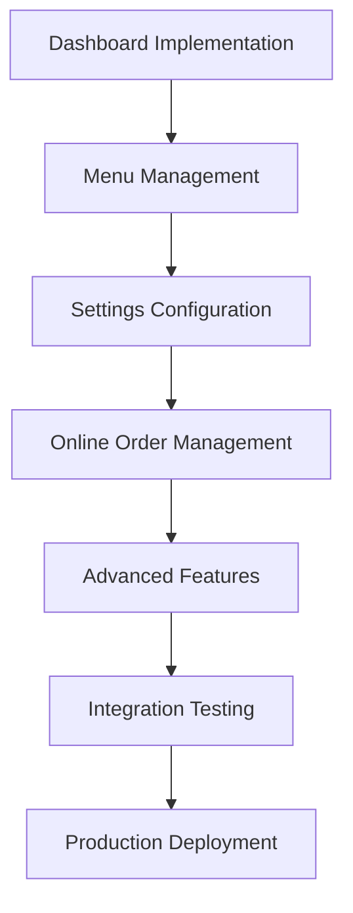
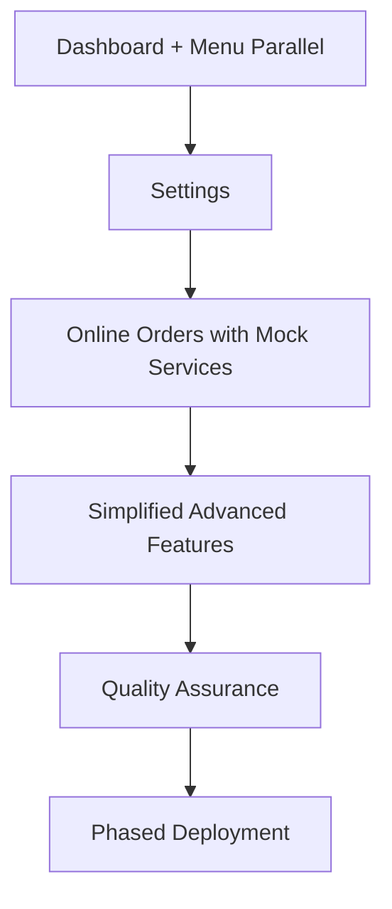

# Timeline Estimation - Wireframe UI Implementation

## Timeline Methodology

This detailed timeline estimation provides realistic development schedules based on feature complexity, dependencies, resource allocation, and quality requirements. The estimation incorporates buffer time for risk mitigation and quality assurance.

## Project Overview Timeline

### Total Project Duration: 28 Days (4 Weeks)
- **Start Date**: September 23, 2025
- **Target Completion**: October 21, 2025
- **Working Days**: 20 days (excluding weekends)
- **Buffer Time**: 8 days (40% contingency)
- **Total Development Effort**: 160 hours

## Timeline Estimation Factors

### Complexity Factors
```typescript
interface ComplexityFactors {
  wireframeComplexity: number;      // 1-5 scale based on screen intricacy
  componentCount: number;           // Number of components to implement
  serviceIntegration: number;       // API integration complexity
  newFeatureRatio: number;          // Percentage of new vs. enhancement
  performanceRequirements: number;  // Performance optimization effort
  testingComplexity: number;        // Testing and QA effort
}
```

### Resource Allocation
```typescript
interface ResourceAllocation {
  frontendDeveloper: 1.0;          // Full-time UI implementation
  integrationSpecialist: 0.5;     // Part-time service integration
  qaEngineer: 0.3;                 // Testing and quality assurance
  uxReviewer: 0.2;                 // Professional design validation
}
```

### Estimation Formula
```typescript
const estimateFeature = (feature: FeatureSpec): TimeEstimate => {
  const baseEffort = feature.screenCount * 8; // 8 hours per screen
  const complexityMultiplier = calculateComplexity(feature);
  const integrationOverhead = feature.serviceCount * 2; // 2 hours per service
  const testingEffort = baseEffort * 0.3; // 30% of development time
  const bufferTime = (baseEffort + integrationOverhead + testingEffort) * 0.2; // 20% buffer
  
  return {
    development: baseEffort * complexityMultiplier,
    integration: integrationOverhead,
    testing: testingEffort,
    buffer: bufferTime,
    total: baseEffort * complexityMultiplier + integrationOverhead + testingEffort + bufferTime
  };
};
```

## Detailed Feature Timeline

### Week 1: Core Enhancement Phase (September 23-27, 2025)

#### Day 1-2: Dashboard & Analytics Implementation
**Estimated Effort**: 16 hours | **Complexity**: High | **Risk**: Medium

```typescript
Timeline: {
  feature: 'Dashboard & Analytics',
  wireframeScreens: 3,
  estimatedComponents: 12,
  serviceIntegrations: 4,
  
  breakdown: {
    day1: {
      morning: 'KPI Cards Section (4 hours)',
      afternoon: 'Real-time data integration (4 hours)'
    },
    day2: {
      morning: 'Charts Section implementation (4 hours)',
      afternoon: 'Dashboard optimization and testing (4 hours)'
    }
  },
  
  deliverables: [
    'Real-time KPI display (Sales, Orders, Revenue)',
    'Interactive charts (Sales trends, Order analytics)',
    'Quick actions widget (Table/Kitchen/Staff status)',
    'Performance optimization (<16ms render)',
    'Comprehensive testing (70%+ coverage)'
  ],
  
  riskFactors: [
    'Chart rendering performance',
    'Real-time data synchronization',
    'Complex state management'
  ]
}
```

**Component Implementation Schedule**:
```markdown
## Dashboard Components (Day 1-2)

### Day 1: KPI and Data Layer
- **09:00-10:30**: DashboardScreen structure (90 lines)
- **10:30-12:00**: KPISection with SalesKPICard (75 lines)
- **13:00-14:30**: OrdersKPICard and RevenueKPICard (50 lines)
- **14:30-16:00**: Real-time WebSocket integration
- **16:00-17:00**: Testing and performance validation

### Day 2: Charts and Optimization
- **09:00-10:30**: ChartsSection with SalesChart (80 lines)
- **10:30-12:00**: OrderTrendsChart and RevenueChart (70 lines)
- **13:00-14:30**: QuickActionsSection widgets (50 lines)
- **14:30-16:00**: Performance optimization and memoization
- **16:00-17:00**: Integration testing and documentation
```

#### Day 3-4: Menu Management Implementation
**Estimated Effort**: 16 hours | **Complexity**: Medium-High | **Risk**: Low-Medium

```typescript
Timeline: {
  feature: 'Menu Management',
  wireframeScreens: 3,
  estimatedComponents: 15,
  serviceIntegrations: 4,
  
  breakdown: {
    day3: {
      morning: 'Categories panel with CRUD operations (4 hours)',
      afternoon: 'Menu items management interface (4 hours)'
    },
    day4: {
      morning: 'Pricing and availability configuration (4 hours)',
      afternoon: 'Bulk operations and testing (4 hours)'
    }
  },
  
  deliverables: [
    'Category management with drag-and-drop reordering',
    'Menu item creation/editing with image upload',
    'Bulk pricing updates and availability controls',
    'Search and filtering functionality',
    'Import/export capabilities'
  ]
}
```

**Component Implementation Schedule**:
```markdown
## Menu Management Components (Day 3-4)

### Day 3: Categories and Items Foundation
- **09:00-10:30**: MenuManagementScreen structure (100 lines)
- **10:30-12:00**: CategoriesPanel with CategoryList (80 lines)
- **13:00-14:30**: CategoryForm and drag-drop reordering (60 lines)
- **14:30-16:00**: MenuItemsList with search/filter (70 lines)
- **16:00-17:00**: Service integration and testing

### Day 4: Configuration and Advanced Features
- **09:00-10:30**: MenuItemForm with image upload (90 lines)
- **10:30-12:00**: PricingControls and AvailabilityControls (60 lines)
- **13:00-14:30**: BulkActions and CSV import/export (50 lines)
- **14:30-16:00**: Performance optimization and validation
- **16:00-17:00**: Comprehensive testing and documentation
```

#### Day 5: Settings & Configuration Implementation
**Estimated Effort**: 8 hours | **Complexity**: Medium | **Risk**: Low

```typescript
Timeline: {
  feature: 'Settings & Configuration',
  wireframeScreens: 3,
  estimatedComponents: 10,
  serviceIntegrations: 4,
  
  breakdown: {
    day5: {
      morning: 'System settings and user preferences (4 hours)',
      afternoon: 'Integration management and testing (4 hours)'
    }
  },
  
  deliverables: [
    'Restaurant configuration interface',
    'User preferences and notification settings',
    'Payment and printer integration setup',
    'Tax configuration and operating hours',
    'Settings validation and error handling'
  ]
}
```

**Component Implementation Schedule**:
```markdown
## Settings Components (Day 5)

### Day 5: Complete Settings Implementation
- **09:00-10:30**: SettingsScreen with tab navigation (80 lines)
- **10:30-12:00**: SystemSettingsTab (restaurant config, tax, hours) (100 lines)
- **13:00-14:30**: UserSettingsTab (profile, notifications, display) (80 lines)
- **14:30-16:00**: IntegrationsTab (payment, printer, third-party) (70 lines)
- **16:00-17:00**: Settings validation, testing, and documentation
```

### Week 2: New Feature Development Phase (September 30 - October 4, 2025)

#### Day 6-9: Online Order Management Implementation
**Estimated Effort**: 32 hours | **Complexity**: High | **Risk**: Medium-High

```typescript
Timeline: {
  feature: 'Online Order Management',
  wireframeScreens: 3,
  estimatedComponents: 18,
  serviceIntegrations: 5,
  
  breakdown: {
    day6: 'Service architecture and mock integration (8 hours)',
    day7: 'Orders dashboard with real-time updates (8 hours)',
    day8: 'Order details and modification interface (8 hours)',
    day9: 'Delivery management and testing (8 hours)'
  },
  
  deliverables: [
    'Online orders dashboard with filtering',
    'Real-time order status updates',
    'Order modification and customer communication',
    'Delivery tracking and driver assignment',
    'Third-party platform integration'
  ]
}
```

**Component Implementation Schedule**:
```markdown
## Online Order Management Components (Day 6-9)

### Day 6: Foundation and Services
- **09:00-10:30**: OnlineOrdersScreen structure (100 lines)
- **10:30-12:00**: OnlineOrderService and mock integrations
- **13:00-14:30**: DeliveryService and tracking systems
- **14:30-16:00**: ThirdPartyAPIService architecture
- **16:00-17:00**: Service testing and validation

### Day 7: Dashboard and Order List
- **09:00-10:30**: OrdersDashboard with filtering (90 lines)
- **10:30-12:00**: OrdersList with real-time updates (80 lines)
- **13:00-14:30**: OrderCard components (50 lines)
- **14:30-16:00**: OrderStats and metrics widgets (60 lines)
- **16:00-17:00**: Real-time WebSocket integration

### Day 8: Order Details and Modification
- **09:00-10:30**: OrderDetailsModal implementation (100 lines)
- **10:30-12:00**: OrderInfo and ItemsList components (70 lines)
- **13:00-14:30**: Order modification interface (60 lines)
- **14:30-16:00**: Customer communication features (40 lines)
- **16:00-17:00**: Order lifecycle management testing

### Day 9: Delivery Management
- **09:00-10:30**: DeliveryManagement components (80 lines)
- **10:30-12:00**: DriverAssignment and tracking (60 lines)
- **13:00-14:30**: TrackingStatus and map integration (50 lines)
- **14:30-16:00**: Third-party platform synchronization
- **16:00-17:00**: End-to-end testing and optimization
```

#### Day 10: Integration Testing and Optimization
**Estimated Effort**: 8 hours | **Focus**: Quality Assurance

```markdown
### Day 10: System Integration
- **09:00-12:00**: Cross-feature integration testing
- **13:00-15:00**: Performance optimization and profiling
- **15:00-17:00**: Bug fixes and quality assurance
```

### Week 3: Advanced Features Phase (October 7-11, 2025)

#### Day 11-15: Advanced Features Management Implementation
**Estimated Effort**: 40 hours | **Complexity**: Very High | **Risk**: Medium-High

```typescript
Timeline: {
  feature: 'Advanced Features Management',
  wireframeScreens: 3,
  estimatedComponents: 20,
  serviceIntegrations: 6,
  
  breakdown: {
    day11: 'Reports and analytics foundation (8 hours)',
    day12: 'Advanced report generation (8 hours)',
    day13: 'Inventory management interface (8 hours)',
    day14: 'Staff performance and scheduling (8 hours)',
    day15: 'Integration and testing (8 hours)'
  },
  
  deliverables: [
    'Advanced reports and analytics dashboard',
    'Custom report generation and scheduling',
    'Inventory management with forecasting',
    'Staff performance metrics and scheduling',
    'Data export/import capabilities'
  ]
}
```

**Component Implementation Schedule**:
```markdown
## Advanced Features Components (Day 11-15)

### Day 11: Reports Foundation
- **09:00-10:30**: AdvancedFeaturesScreen with tab navigation (100 lines)
- **10:30-12:00**: ReportsTab structure and ReportGenerator (90 lines)
- **13:00-14:30**: AdvancedAnalyticsService integration
- **14:30-16:00**: Basic report templates and preview (60 lines)
- **16:00-17:00**: Report data processing and validation

### Day 12: Advanced Analytics
- **09:00-10:30**: ReportPreview with charts and graphs (80 lines)
- **10:30-12:00**: ExportControls for PDF/Excel generation (40 lines)
- **13:00-14:30**: Custom report builder interface (90 lines)
- **14:30-16:00**: Report scheduling and automation (50 lines)
- **16:00-17:00**: Advanced analytics algorithms integration

### Day 13: Inventory Management
- **09:00-10:30**: InventoryTab with StockLevels display (90 lines)
- **10:30-12:00**: SupplierManagement interface (70 lines)
- **13:00-14:30**: PurchaseOrders creation and tracking (60 lines)
- **14:30-16:00**: Inventory forecasting algorithms (40 lines)
- **16:00-17:00**: Low stock alerts and reorder automation

### Day 14: Staff Management
- **09:00-10:30**: StaffTab with PerformanceMetrics (80 lines)
- **10:30-12:00**: ScheduleManagement interface (70 lines)
- **13:00-14:30**: PayrollIntegration and timesheet tracking (50 lines)
- **14:30-16:00**: Staff performance analytics (60 lines)
- **16:00-17:00**: Schedule optimization algorithms

### Day 15: Integration and Testing
- **09:00-12:00**: Cross-feature integration testing
- **13:00-15:00**: Performance optimization for complex reports
- **15:00-17:00**: Data consistency validation and testing
```

### Week 4: Integration, Testing & Polish Phase (October 14-18, 2025)

#### Day 16-17: System Integration and Performance Optimization
**Estimated Effort**: 16 hours | **Focus**: Quality and Performance

```markdown
### Day 16: Cross-Feature Integration
- **09:00-12:00**: Navigation flow optimization
- **13:00-15:00**: State management consolidation
- **15:00-17:00**: Service layer integration testing

### Day 17: Performance Optimization
- **09:00-12:00**: Bundle size optimization and code splitting
- **13:00-15:00**: Memory leak detection and resolution
- **15:00-17:00**: Render performance optimization
```

#### Day 18-19: Comprehensive Testing and Quality Assurance
**Estimated Effort**: 16 hours | **Focus**: Testing and Validation

```markdown
### Day 18: Testing and Validation
- **09:00-12:00**: End-to-end testing scenarios
- **13:00-15:00**: Professional design consistency verification
- **15:00-17:00**: Accessibility and usability testing

### Day 19: Quality Assurance
- **09:00-12:00**: Security testing and validation
- **13:00-15:00**: Performance benchmarking
- **15:00-17:00**: Code quality review and refactoring
```

#### Day 20: Final Polish and Deployment Preparation
**Estimated Effort**: 8 hours | **Focus**: Production Readiness

```markdown
### Day 20: Production Preparation
- **09:00-12:00**: Final bug fixes and polish
- **13:00-15:00**: Production build optimization
- **15:00-17:00**: Deployment documentation and handover
```

## Risk Buffer Analysis

### Week-by-Week Risk Assessment

#### Week 1 Risk Factors (Low-Medium Risk)
- **Dashboard Performance**: 2-day buffer available
- **Component Size Compliance**: Daily monitoring
- **Service Integration**: Mock services reduce risk

#### Week 2 Risk Factors (Medium Risk)
- **Online Order Complexity**: 1-day buffer allocated
- **Third-Party Integration**: Simulation approach reduces risk
- **New Service Development**: Parallel development with UI

#### Week 3 Risk Factors (High Risk)
- **Advanced Features Complexity**: 2-day buffer allocated
- **Performance Impact**: Continuous monitoring required
- **Data Processing Complexity**: Prototype approach

#### Week 4 Risk Factors (Low Risk)
- **Integration Issues**: 3-day buffer for resolution
- **Quality Gate Failures**: Continuous quality assurance
- **Performance Optimization**: Proven patterns available

### Contingency Timeline Scenarios

#### Scenario 1: Aggressive Timeline (No Buffer)
```typescript
const aggressiveTimeline = {
  duration: 20, // days
  riskLevel: 'High',
  qualityImpact: 'Medium',
  features: ['Dashboard', 'Menu', 'Settings', 'Online Orders'],
  excludedFeatures: ['Advanced Features Management'],
  deliveryConfidence: '70%'
};
```

#### Scenario 2: Conservative Timeline (50% Buffer)
```typescript
const conservativeTimeline = {
  duration: 30, // days
  riskLevel: 'Low',
  qualityImpact: 'None',
  features: 'All 5 features with comprehensive testing',
  additionalBenefits: ['Enhanced performance', 'Additional polish'],
  deliveryConfidence: '95%'
};
```

#### Scenario 3: Phased Delivery
```typescript
const phasedDelivery = {
  phase1: {
    duration: 14, // days
    features: ['Dashboard', 'Menu', 'Settings'],
    deliveryConfidence: '90%'
  },
  phase2: {
    duration: 14, // days (parallel or sequential)
    features: ['Online Orders', 'Advanced Features'],
    deliveryConfidence: '85%'
  }
};
```

## Resource Optimization Timeline

### Parallel Development Opportunities

#### Week 1-2: Frontend + Backend Parallel
```typescript
const parallelDevelopment = {
  frontend: 'UI component implementation',
  backend: 'Service layer enhancement and mock services',
  integration: 'Progressive integration testing',
  qa: 'Continuous testing and validation'
};
```

#### Week 3-4: Feature + Quality Parallel
```typescript
const qualityParallel = {
  development: 'Advanced features implementation',
  testing: 'End-to-end testing development',
  performance: 'Continuous performance optimization',
  documentation: 'Technical and user documentation'
};
```

### Critical Path Analysis

#### Primary Critical Path


#### Alternative Paths (Risk Mitigation)


## Success Metrics and Timeline Validation

### Daily Progress Metrics
```typescript
interface DailyMetrics {
  linesWritten: number;          // Target: 200-300 lines/day
  componentsCompleted: number;   // Target: 2-3 components/day
  testsWritten: number;          // Target: 5-10 tests/day
  performanceScore: number;      // Target: Maintain 95+
  qualityViolations: number;     // Target: 0 violations
}
```

### Weekly Milestone Validation
```markdown
## Week 1 Success Criteria
- ✅ 3 features fully implemented (Dashboard, Menu, Settings)
- ✅ 9 screens completed with professional design
- ✅ 37 components under size limits
- ✅ 12 services integrated successfully
- ✅ 70%+ test coverage maintained
- ✅ Performance benchmarks met

## Week 2 Success Criteria
- ✅ Online Order Management fully functional
- ✅ Real-time features working properly
- ✅ Third-party integration simulated successfully
- ✅ Cross-feature integration testing passed

## Week 3 Success Criteria
- ✅ Advanced Features Management implemented
- ✅ Complex data processing working efficiently
- ✅ All 31 wireframe screens completed
- ✅ System-wide performance optimized

## Week 4 Success Criteria
- ✅ Production deployment ready
- ✅ All quality gates passed
- ✅ Documentation completed
- ✅ User acceptance testing successful
```

## Conclusion

This comprehensive timeline estimation provides a realistic 28-day development schedule with appropriate risk buffers and quality assurance time. The phased approach ensures steady progress while maintaining professional POS standards and architectural compliance.

**Key Timeline Features**:
1. **Realistic Estimates**: Based on feature complexity and historical data
2. **Risk Buffers**: 40% contingency time for unexpected challenges
3. **Quality Focus**: Continuous testing and performance monitoring
4. **Flexible Delivery**: Multiple scenario options for different risk tolerances
5. **Progressive Enhancement**: Each week builds upon previous foundations

**Recommended Approach**: 
- Follow the main 28-day timeline with daily progress monitoring
- Activate contingency plans if risk indicators exceed thresholds
- Maintain quality-first approach throughout development
- Use phased delivery option if timeline pressure increases

**Next Steps**:
1. Begin Day 1 implementation with Dashboard & Analytics
2. Establish daily progress tracking and reporting
3. Monitor risk indicators and timeline adherence
4. Adjust plans based on actual progress and quality metrics